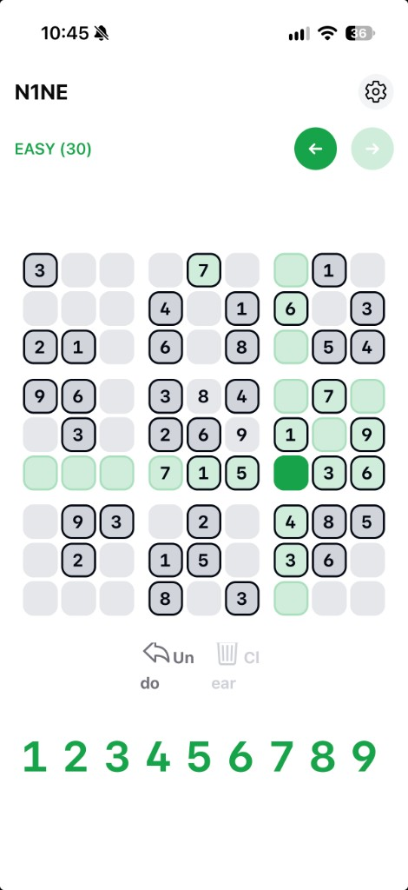
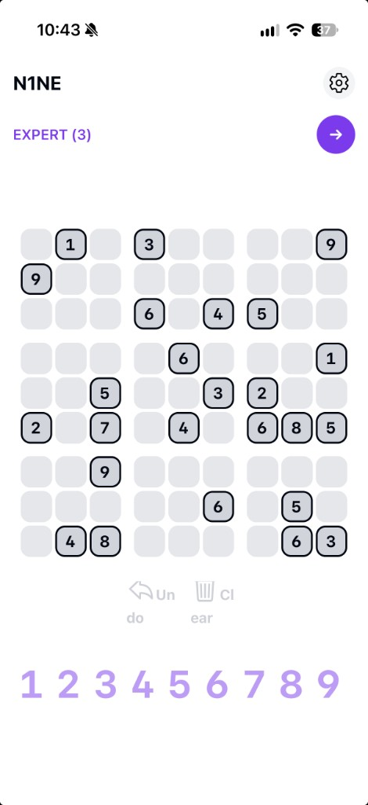
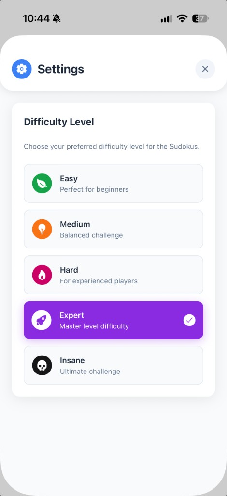

# Sudoku (React Native)

Minimal but stylish **Sudoku** app built with **Expo**, **React Native**, **TypeScript**, **NativeWind** (Tailwind), and **expo-sqlite**. (WIP)

## Overview

| Gameplay (easy) | Gameplay (expert) | Settings |
| --- | --- | --- |
|  |  |  |

- Preloaded **puzzle database** (`assets/data/puzzles.db`) shipped as an app asset  
- Separate **user database** for in-progress games and solved state  
- Difficulty-themed UI (easy → insane)  
- Notes, validation, progress persistence  

## Tech stack

| Layer | Choice |
|-------|--------|
| Runtime | Expo SDK 57, React Native 0.86 |
| Styling | NativeWind 4 + Tailwind |
| Data | expo-sqlite (puzzles + progress) |
| UX | expo-haptics (partial), gesture handler |

## Project structure

```
App.tsx                 → providers + shell
src/components/         → Sudoku grid, settings, header
src/hooks/              → game state (useSudokuGame)
src/services/           → puzzle + progress services
src/provider/           → SQLite providers
src/sql/                → schema for user DB
assets/data/puzzles.db  → bundled puzzles (build from CSV via scripts)
```

Puzzle generation is documented in [assets/data/README.md](assets/data/README.md) (external `sudoku-generator` repo).

## Prerequisites

- Node.js 18+  
- For **iOS simulator:** Xcode  
- For **Android:** Android Studio / emulator  
- Optional: [Expo Go](https://expo.dev/go) on a physical device  

## Run locally

```bash
cd sudoku-app
npm install
npx expo start
```

Then:

- Scan the **QR code** with **Expo Go** (App Store / Play Store — use a build that supports **SDK 57**)
- Press **`i`** — iOS Simulator (Expo Go or dev build)  
- Press **`a`** — Android emulator  

This project targets **Expo Go** (no custom dev client). Optional native folders from an older SDK can be removed: `rm -rf ios android` and rely on Expo Go, or regenerate with `npx expo prebuild` when you need a standalone build.

```bash
npm run ios    # requires prebuild / Xcode project
npm run android
```

### Rebuild puzzle database (optional)

```bash
# After generating CSVs (see assets/data/README.md)
python3 src/data/import_csv_puzzles_to_puzzles_db.py
# or src/data/import_puzzles.sh
```

## Roadmap

See [todos-for-release.md](todos-for-release.md) (i18n, icon, splash, haptics polish, more puzzles).

## License

[MIT License](LICENSE).
